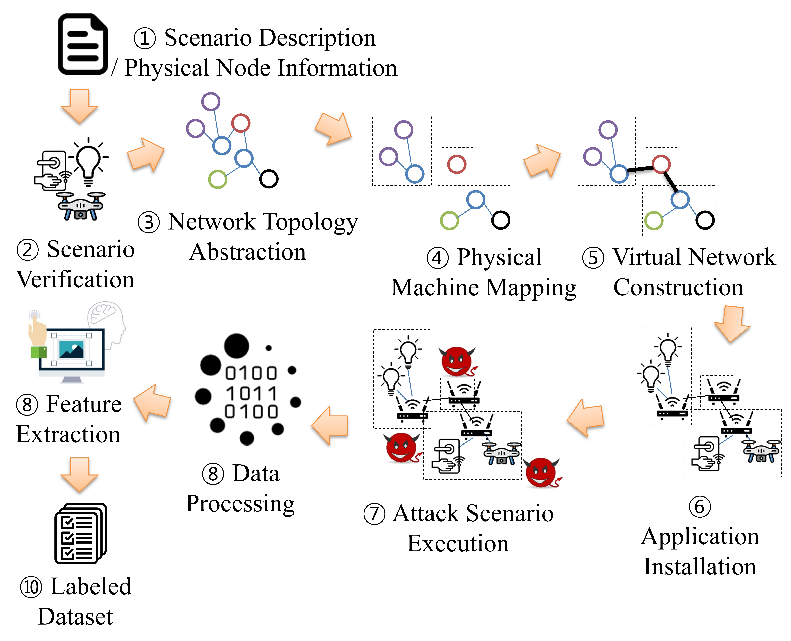

# Modules of IoTDSCreator

IoTDSCreator consists of 8 modules, including:
 - Scenario Verifier (2, scenario_verifier.py): it verifies the correctness of a scenario description.
 - Network Topology Abstracter (3, network_topology_abstractor.py): it generates an abstract network from a scenario description.
 - Physical Machine Mapper (4, physical_machine_mapper.py): it maps virtual subnetworks and physical machines based on a greedy algorithm.
 - Virtual Network Constructor (5, virtual_network_constructor.py): it lets each physical machine construct assigned subnetworks.
 - Application Installer (6, application_installer.py): it installs required applications per device/machine.
 - Attack Scenario Execution (7, attack_scenario_execution.py): it executes applications and performs attacks according to the attack scenario.
 - Data Labeler (8, data_labeler.py): it labels data by comparing captured packets from diverse network interfaces.
 - Feature Extractor (9, feature_extractor.py): it extracts features from the labeled raw data.
